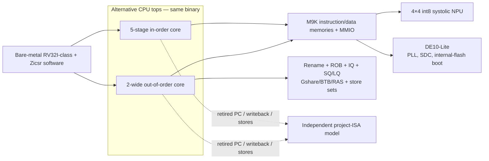

<p align="center">
  
  
  
  
  
  <a href="https://github.com/hannaashkar/rv32i_cpu/actions/workflows/ci.yml"></a>
</p>

# RISC-V SoC — from a 5-stage core to an out-of-order CPU with an AI accelerator, running on real hardware

**Hanna Ashkar** · Electrical Engineering, Technion · Digital Design / Computer Architecture / RISC-V

A RISC-V **RV32I-class + Zicsr** system-on-chip built and measured in stages: a
classic 5-stage in-order pipeline, upgraded into a **2-wide out-of-order
superscalar** with register renaming, speculative loads and a **store-set
memory-dependence predictor**, extended with a tightly-coupled **4×4 int8
systolic-array NPU** that runs a real quantized MNIST neural network — and
brought up on an FPGA, where it **boots standalone from on-chip flash**.
Every stage is **benchmarked, golden-model-verified, and reproducible** —
measurement matters as much as the RTL.

https://github.com/user-attachments/assets/236d160b-ccb6-4e1c-92c8-c92e5c0e4397

One compiled C binary runs on two independently measured cores. Speculation
and recovery are checked at retirement against an independent ISA model, the
accelerator runs a real quantized network, and an OoO SoC configuration has
crossed simulation, place-and-route, timing closure, and physical bring-up.

---

## 📊 Results at a glance

| Evidence domain | Configuration | Headline result | Proof |
|---|---|---|---|
| **Tagged RTL milestones** | `v1.0-inorder-baseline` → `v2.0-ooo` | **1.177 → 1.397 CoreMark/MHz (+18.8%)**, IPC 0.849 → 1.008 | CRC-validated, reportable CoreMark runs |
| **Current CPU A/B** | D025, exact same 720-iteration image | **1.176568 → 1.422560 CoreMark/MHz (+20.91%)**, IPC 0.849 → 1.026 | Two reportable runs; 519.45M instructions each, lockstep-clean |
| **Current RTL + NPU** | D025, same quantized 784→32→10 network | **85.99× / 93.30×** cycle speedup on in-order / OoO; NPU and software bit-exact on **32/32** exported images | Cycle-accurate simulation + lockstep |
| **Verification** | Both cores | **99.2% RTL line coverage**, 40/40 `riscv-tests` rv32ui, **14 RTL/SoC integration bugs** documented | Reproducible merge gates |
| **Current Quartus build** | OoO + NPU + MNIST image, D025 | **34,714 / 49,760 LEs (70%)**, 95/182 M9Ks, timing met at 16.67 MHz with **+17.47 ns** slack | Fitter + slow-85C STA |
| **Hardware-confirmed** | In-order bring-up; OoO revision containing the NPU | **50 MHz** in-order; **16.67 MHz** OoO, M9K code + standalone flash boot | DE10-Lite; OoO proof ran the LED walker |
| **Pending acceptance** | Current D025 MNIST image | `.sof` built and timing-clean; **first physical MNIST flash still pending** | Simulation/Quartus complete, silicon demo not claimed |

The offline integer model scores **97.13% on all 10,000 MNIST test images**;
that is distinct from the 32-image RTL validation above. Performance numbers
come from hardware counters in cycle-accurate simulation. The table labels
Quartus-only, hardware-confirmed, and pending results separately. Full methods
and evidence: [`docs/PROJECT_BRIEF.md`](docs/PROJECT_BRIEF.md).

---

## System at a glance



The measured project brief, technical case studies, evidence ledger, and
documented limitations live in [`docs/PROJECT_BRIEF.md`](docs/PROJECT_BRIEF.md).

---

## 🧩 What's inside

### 1. In-order core — the baseline (`rtl/core/`)
Classic 5-stage pipeline (IF → ID → EX → MEM → WB) with full forwarding
(EX←MEM, EX←WB, store-data, register write→read bypass), load-use
interlock, a 64-entry 2-bit BHT + tagged BTB, and byte/half/word memory.
RV32I integer compute, load/store, and control-flow instructions, Zicsr
operations, and cycle/instret counters for self-measurement. Traps and
privileged execution are not implemented. It runs compiled C and the full
CoreMark benchmark, and meets **50 MHz** on the FPGA (STA Fmax 53.95 MHz).

### 2. Out-of-order core — the upgrade (`rtl/ooo/`, [`docs/OOO.md`](docs/OOO.md))
A 2-wide out-of-order superscalar that runs the **identical binary** as the
baseline. The initial `v2.0-ooo` milestone was +18.8% in CoreMark/MHz; the
current D025 core measures **+20.91%** on the exact same 720-iteration image:
- **Register renaming** — R10K-style merged physical register file (64
  registers), RAT + free list. Its 6-read/3-write storage uses a textbook
  live-value-table construction over **18 M9Ks**, cutting **8,895 LEs** with
  cycle-identical behavior ([`docs/PRF_SHRINK.md`](docs/PRF_SHRINK.md))
- **32-entry ROB**, 2-wide dispatch/retire; **16-entry unified issue queue**
  whose select logic was restructured from a serial scan into a balanced
  log-depth tree — **2.33× Fmax** at bit-identical IPC, proven by lockstep
  ([`docs/DECISIONS.md`](docs/DECISIONS.md) D019)
- **Speculative execution with full recovery** — gshare (1024) + BTB (64) +
  RAS (8), 8 per-branch RAT checkpoints, single-cycle mispredict restore
- **Speculative loads** — 8-entry store queue with store-to-load forwarding
  + 8-entry load queue with a violation CAM and flush-at-head repair
  ([`docs/LQ.md`](docs/LQ.md)), governed by a **store-set
  memory-dependence predictor** (Chrysos & Emer, ISCA '98 — measured
  against the Alpha 21264's 1-bit scheme and beating it by 12.7% on a
  pointer-chase microbenchmark; [`docs/STORESET.md`](docs/STORESET.md))

### 3. NPU — the accelerator (`rtl/npu/`, [`docs/NPU.md`](docs/NPU.md))
A 4×4 **output-stationary systolic array** of int8 MAC units, memory-mapped
so both cores can drive it, mapping to **16 hardware multipliers** on the
FPGA. Its offline integer model reaches **97.13% accuracy on the full 10,000-
image MNIST test set**. On RTL, the same network runs **85.99× faster** on the
in-order core and **93.30× faster** on the current OoO core than their
respective software paths, with NPU logits **bit-exact on 32/32 exported
images**. The memory-ordering
between CPU and accelerator is enforced in hardware (no software polling).

### 4. On silicon — where simulation meets physics ([`docs/DEMO.md`](docs/DEMO.md))
The best lesson in the project: **wall-clock performance = IPC × Fmax.**
The OoO core's first board port won +18.8% IPC but managed only 8.42 MHz —
the un-pipelined issue-queue select+wakeup was a ~118 ns critical path —
making it ~6× *slower* than the in-order core on the same chip. Rewriting
the selection logic as a balanced log-depth tree raised Fmax 2.33× with
**bit-identical** cycle behavior (proven by lockstep), and the board now
runs the full OoO SoC at 16.67 MHz. Along the way: a three-session mystery
("MIF is not supported for the selected family") turned out to be **one
missing QSF line** — MAX 10 needs an ERAM-capable configuration mode to
initialize block RAM — unlocking M9K-resident program and data memories.
The CPU **boots standalone from internal flash** (verified on the board
with the bring-up program); the same mechanism puts the MNIST demo's
program *and neural-net weights* into block RAM at power-up — there is no
loader, the weights are simply there. The MNIST demo (RTL + software
complete, self-test lockstep-verified on both cores, 8/8 images correct;
board bitstream now **builds and closes timing** — the gshare-PHT and PRF
M9K conversions (D024/D025) cut the current demo top to **34,714 / 49,760
LEs (70%)** with **+17.47 ns** setup slack, and the `.sof` is built; the
on-silicon MNIST flash is the
remaining step): flip three switches to pick a handwritten
digit, the 7-segment displays show the true label next to the network's
answer — ~3 ms per inference at the 16.67 MHz board clock
(simulation-measured), with the OoO core using **45.3% fewer cycles**
(376,112 vs 687,018), a **1.83× cycle-speedup** over the in-order core.

---

## 🧪 Verification — the part that makes it real

The whole SoC is checked by **golden-model lockstep co-simulation**: an
independently implemented model of the project's ISA behavior
([`tb/verilator/iss.h`](tb/verilator/iss.h))
runs in step with the RTL and compares **every retired instruction** — PC,
register writeback, and every memory store — aborting at the *exact*
instruction on any divergence. Six merge-gate lanes run on **both cores**;
the OoO core adds dedicated load-violation stress, and reportable benchmarks
run separately through the same lockstep checker:

| Layer | Command | Coverage |
|---|---|---|
| Directed tests | `make regress` | **20/20** targeted assembly+C suites |
| Third-party integer suite | `make regress-isa` | `riscv-tests` rv32ui **40/40** |
| Constrained-random | `make regress-rand` | 25 seeds × 3000 instructions, seeded/reproducible |
| System/decode tail | `make regress-rand-sys` | 1,148 FENCE/ECALL/EBREAK/reserved words per core |
| NPU ordering | `make regress-rand-npu` | 282 adversarial bursts / 564 GO commands per core |
| Violation stress (OoO only) | `make regress-rand-vio` | 1,185 real load-ordering violations exercising the recovery path |
| Randomized initial/reset state | `make regress-x` | 80/80 program-seed runs per core |
| Benchmark (separate) | `make coremark-compare` | Reportable same-image A/B, ~519.45M instructions/core, CRC-validated **and** lockstep-checked |

Merged Verilator line coverage across both cores is **99.2% (1428/1440)**.
The remaining 12 lines are published rather than waived away; see
[`docs/VERIFICATION.md`](docs/VERIFICATION.md).

Every real RTL/SoC integration bug is root-caused and written up in
[`docs/BUGLOG.md`](docs/BUGLOG.md) (**14 so far**) — including ones only
this infrastructure could catch: an issue-queue flush that cleared *zero*
entries because a 6-bit relative age can never exceed 63 (B013), an
operand-decay bug during a pipeline hold that compiled C can never trigger
(B011, caught by adversarial design review), and a one-cycle predictor
race caught by its own assertion on its first run (B014). Every
architectural decision, with the alternatives considered, is logged in
[`docs/DECISIONS.md`](docs/DECISIONS.md).

---

## 📂 Repository layout

```
rtl/
  core/   5-stage in-order pipeline + shared leaf units (ALU, regfile, CSRs)
  ooo/    2-wide out-of-order core (rename, ROB, IQ, SQ/LQ, store sets, gshare/BTB/RAS)
  npu/    4×4 int8 systolic array + MMIO front end
  mem/    banked M9K instruction ROM, byte-enabled block-RAM dmem (MIF-initialized)
  soc/    mmio (LEDs / switches / 7-segment displays)
  top/    de10_top (DE10-Lite board wrapper: PLL, reset sync)
tb/verilator/   C++ harness + golden-model ISS (lockstep co-sim)
sw/       assembly + C tests, C runtime, CoreMark port, MNIST MLP (sim + board)
synth/    Quartus project for the DE10-Lite (+ checked-in memory images)
docs/     architecture, measurements, verification, bug/decision logs, project brief
scripts/  MNIST training/quantization, random test generator, hex→MIF flow
```

---

## ▶️ Reproduce the numbers

```bash
make verify          # in-order: all six lanes, including NPU + randomized reset
make verify-ooo      # OoO: same six lanes + load-violation recovery stress
make coremark        # full/reportable current in-order CoreMark run
make coremark-ooo    # full/reportable current OoO run (720 iterations by default)
make coremark-compare # both cores, exact same 720-iteration image + separate logs
make coremark-quick  # short CRC-only smoke run (also: coremark-quick-ooo)
make npu-mlp         # MNIST MLP: software vs NPU, bit-exact + measured speedup
make npu-mlp-board   # the board demo's self-test, run in simulation (both cores: -ooo)
make npu-tb          # NPU unit testbench vs C++ golden model
make mif             # rebuild the FPGA memory-init images from the demo binaries
```

On the project’s native Windows environment, run the same targets from
PowerShell as `scripts\make.cmd verify`, `scripts\make.cmd verify-ooo`, etc.

Toolchain: Verilator 5.048, xPack riscv-none-elf-gcc 15.2.0, Quartus Prime
Lite 20.1. Target board: Terasic **DE10-Lite** (Intel MAX 10
10M50DAF484C7G). Board bring-up + demo guide: [`docs/DEMO.md`](docs/DEMO.md).

---

## Current scope and limitations

- Implements RV32I integer compute/load-store/control-flow behavior, Zicsr
  operations, and cycle/instret counters. **ECALL/EBREAK do not trap**;
  privileged modes, interrupts, precise exceptions, RV32M/A, and `fence.i`
  are not implemented.
- There is no MMU, cache hierarchy, SDRAM controller, or Linux-capable platform.
  The SoC runs freestanding C, CoreMark, the integer tests, and the MNIST app.
- NPU speedups are RTL-simulation cycle measurements. The latest MNIST
  bitstream fits and closes timing, but its first physical run is still pending.
- The OoO core wins per clock but still loses wall-clock performance to the
  50 MHz in-order core on this FPGA. Current STA points to the LQ violation-CAM
  path—not the scheduler—as the first timing target.

---

## 🗺️ Roadmap

- ✅ RV32I baseline → CoreMark → tagged `v1.0-inorder-baseline`
- ✅ 2-wide out-of-order core → `v2.0-ooo`
- ✅ Tightly-coupled int8 NPU + quantized MNIST → `v3.0-npu`
- ✅ Industry-style verification (lockstep, 40/40 rv32ui, constrained-random, X/reset randomization, **99.2% line coverage**)
- ✅ FPGA bring-up: PLL + SDC timing closure, block-RAM memories → `v3.1-inorder-fpga`
- ✅ Speculative loads + load queue + store-set memory-dependence predictor
- ✅ OoO core on the board: issue-queue select restructured (8.42 → 19.65 MHz), M9K program ROM, standalone flash boot
- ✅ FPGA area recovery: gshare PHT + 6R/3W PRF moved into M9Ks; current demo top **70% LEs**, timing met
- 🚧 On-board MNIST demo: RTL + software done, sim-verified on both cores (8/8 images); current D025 `.sof` builds at 70% LEs with +17.47 ns slack — on-silicon MNIST flash is the last step
- 🔜 Decide and implement an LQ/CAM timing redesign; all current top-20 paths end at `rob_poison`
- 🔜 Rerun STA, then optimize the next measured limiter (scheduler/JALR only if they surface)
- 🔭 ASIC tapeout of the NPU via Tiny Tapeout (SkyWater 130 nm)

---

## 👩‍💻 Author

**Hanna Ashkar** — Electrical Engineering, Technion
FPGA · Digital Design · Computer Architecture · RISC-V

Technical project brief: [`docs/PROJECT_BRIEF.md`](docs/PROJECT_BRIEF.md)
